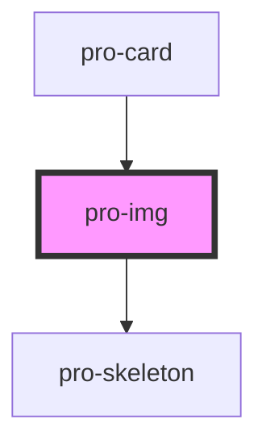

# pro-img

<!-- Auto Generated Below -->

## Properties

| Property | Attribute | Description | Type     | Default                                |
| -------- | --------- | ----------- | -------- | -------------------------------------- |
| `height` | `height`  |             | `number` | `undefined`                            |
| `src`    | `src`     |             | `string` | ``https://picsum.photos/200?random=1`` |
| `width`  | `width`   |             | `number` | `undefined`                            |

## Dependencies

### Used by

 - [pro-card](../card)

### Depends on

- [pro-skeleton](../skeleton)

### Graph

----------------------------------------------

*Built with [StencilJS](https://stenciljs.com/)*
