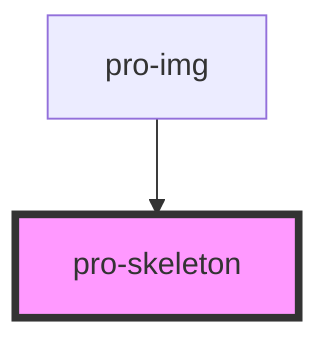

# pro-skeleton

<!-- Auto Generated Below -->

## Properties

| Property   | Attribute  | Description | Type     | Default     |
| ---------- | ---------- | ----------- | -------- | ----------- |
| `height`   | `height`   |             | `number` | `200`       |
| `position` | `position` |             | `string` | `undefined` |
| `width`    | `width`    |             | `number` | `200`       |
| `zIndex`   | `z-index`  |             | `number` | `undefined` |

## Dependencies

### Used by

 - [pro-img](../image)

### Graph

----------------------------------------------

*Built with [StencilJS](https://stenciljs.com/)*
