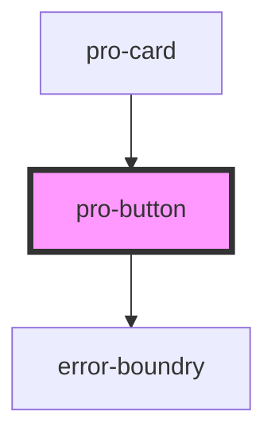

# pro-button

<!-- Auto Generated Below -->

## Properties

| Property | Attribute | Description | Type                         | Default     |
| -------- | --------- | ----------- | ---------------------------- | ----------- |
| `name`   | `name`    |             | `string`                     | `undefined` |
| `styles` | --        |             | `{ [key: string]: string; }` | `undefined` |

## Dependencies

### Used by

 - [pro-card](../card)

### Depends on

- [error-boundry](../../utils)

### Graph

----------------------------------------------

*Built with [StencilJS](https://stenciljs.com/)*
