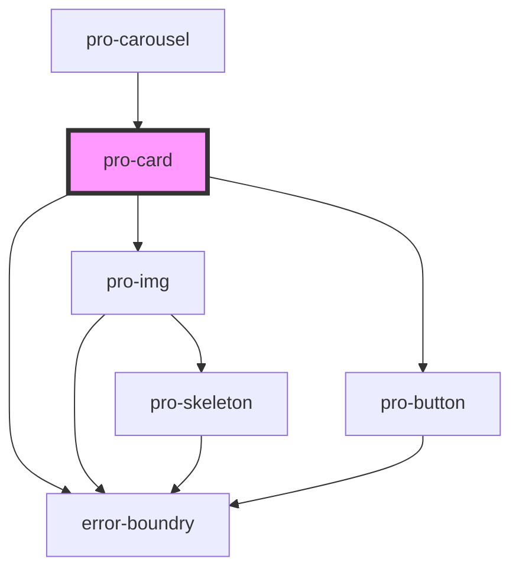

# pro-card

<!-- Auto Generated Below -->

## Properties

| Property | Attribute | Description | Type     | Default     |
| -------- | --------- | ----------- | -------- | ----------- |
| `imgSrc` | `img-src` |             | `string` | `undefined` |

## Dependencies

### Used by

 - [pro-carousel](../carousel)

### Depends on

- [error-boundry](../../utils)
- [pro-img](../image)
- [pro-button](../button)

### Graph

----------------------------------------------

*Built with [StencilJS](https://stenciljs.com/)*
