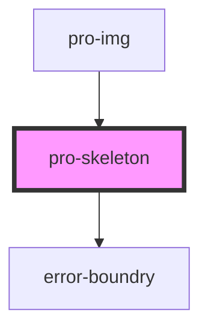

# pro-skeleton

<!-- Auto Generated Below -->

## Dependencies

### Used by

 - [pro-img](../image)

### Depends on

- [error-boundry](../../utils)

### Graph

----------------------------------------------

*Built with [StencilJS](https://stenciljs.com/)*
