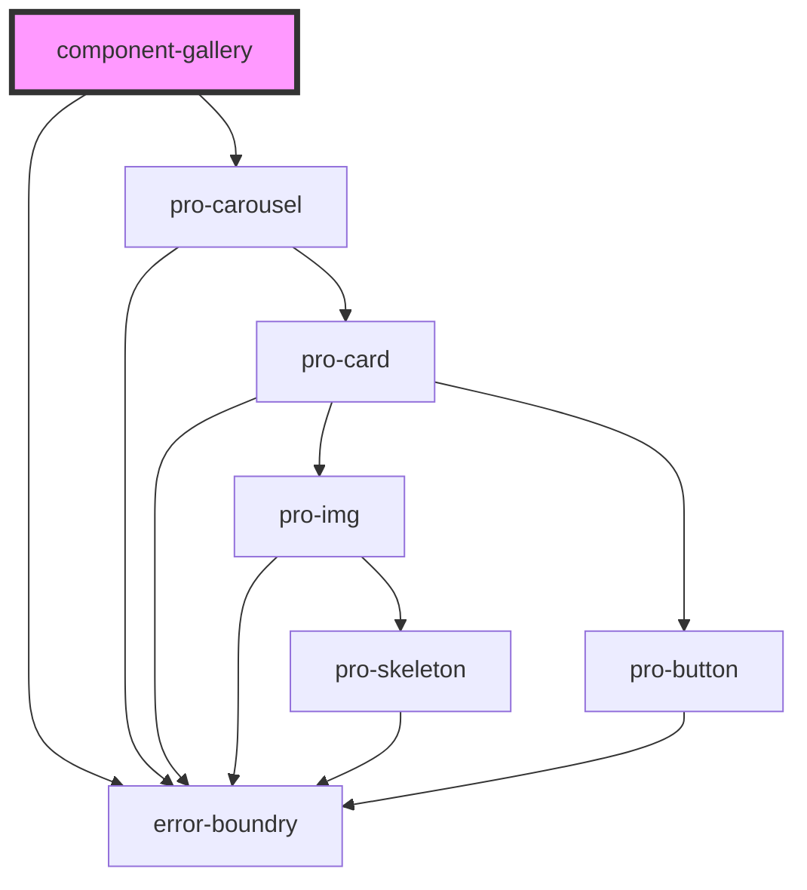

# my-component

<!-- Auto Generated Below -->

## Dependencies

### Depends on

- [error-boundry](../../utils)
- [pro-carousel](../../atoms/carousel)

### Graph

----------------------------------------------

*Built with [StencilJS](https://stenciljs.com/)*
