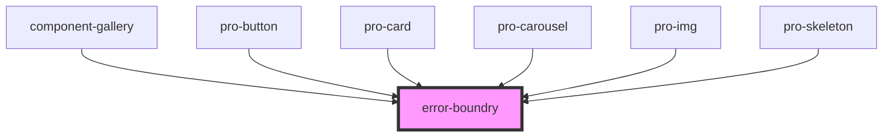

# error-boundry

<!-- Auto Generated Below -->

## Dependencies

### Used by

 - [component-gallery](../molecules/gallery)
 - [pro-button](../atoms/button)
 - [pro-card](../atoms/card)
 - [pro-carousel](../atoms/carousel)
 - [pro-img](../atoms/image)
 - [pro-skeleton](../atoms/skeleton)

### Graph

----------------------------------------------

*Built with [StencilJS](https://stenciljs.com/)*
